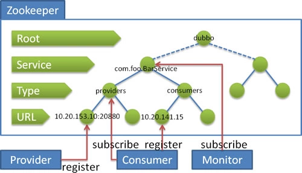

Dubbo 的注册中心虽然提供了多种实现，但生产上的事实标准基本上都是 基于 Zookeeper 实现的。这种注册中心的实现方法也是 Dubbo 最为推荐的。为了易于理解 Zookeeper 在 Dubbo 中的应用，我们先简单看一下 zookeeper。

由于 Dubbo 是一个分布式 RPC 开源框架，各服务之间单独部署，往往会出现资源之间数据不一致的问题，比如：某一个服务增加或减少了几台机器，某个服务提供者变更了服务地址，那么服务消费者是很难感知到这种变化的。而 Zookeeper 本身就有保证分布式数据一致性的特性。那么 Dubbo 服务是如何被 Zookeeper 的数据结构存储管理的呢，zookeeper 采用的是树形结构来组织数据节点，它类似于一个标准的文件系统，如下图所示。



该图展示了 dubbo 在 zookeeper 中存储的形式以及节点层级。dubbo 的 Root 层是根目录，通过<dubbo:registry group="dubbo" />的“group”来设置 zookeeper 的根节点，缺省值是“dubbo”。Service 层是服务接口的全名。Type 层是分类，一共有四种分类，分别是 providers 服务提供者列表、consumers 服务消费者列表、routes 路由规则列表、configurations 配置规则列表。URL 层 根据不同的 Type 目录：可以有服务提供者 URL 、服务消费者 URL 、路由规则 URL 、配置规则 URL 。不同的 Type 关注的 URL 不同。

zookeeper 以斜杠来分割每一层的 znode 节点，比如第一层根节点 dubbo 就是“/dubbo”，而第二层的 Service 层就是/dubbo/com.foo.Barservice，zookeeper 的每个节点通过路径来表示以及访问，例如服务提供者启动时，向/dubbo/com.foo.Barservice/providers 目录下写入自己的 URL 地址。

dubbo-registry-zookeeper 模块的工程结构如下图所示，里面就俩类，非常简单。


### ZookeeperRegistry

该类继承了 FailbackRegistry 抽象类，针对注册中心核心的 服务注册、服务订阅、取消注册、取消订阅，查询注册列表进行展开，这里用到了 模板方法设计模式，FailbackRegistry 中定义了 register()、subscribe()等模板方法和 doRegister()、doSubscribe()抽象方法，ZookeeperRegistry 基于 zookeeper 对这些抽象方法进行了实现。其实你会发现 zookeeper 虽然是最被推荐的，反而它的实现逻辑相对简单，因为调用了 zookeeper 服务组件，很多的逻辑不需要在 dubbo 中自己去实现。

```java
/*
 * Licensed to the Apache Software Foundation (ASF) under one or more
 * contributor license agreements.  See the NOTICE file distributed with
 * this work for additional information regarding copyright ownership.
 * The ASF licenses this file to You under the Apache License, Version 2.0
 * (the "License"); you may not use this file except in compliance with
 * the License.  You may obtain a copy of the License at
 *
 *     http://www.apache.org/licenses/LICENSE-2.0
 *
 * Unless required by applicable law or agreed to in writing, software
 * distributed under the License is distributed on an "AS IS" BASIS,
 * WITHOUT WARRANTIES OR CONDITIONS OF ANY KIND, either express or implied.
 * See the License for the specific language governing permissions and
 * limitations under the License.
 */
package com.alibaba.dubbo.registry.zookeeper;

import com.alibaba.dubbo.common.Constants;
import com.alibaba.dubbo.common.URL;
import com.alibaba.dubbo.common.logger.Logger;
import com.alibaba.dubbo.common.logger.LoggerFactory;
import com.alibaba.dubbo.common.utils.ConcurrentHashSet;
import com.alibaba.dubbo.common.utils.UrlUtils;
import com.alibaba.dubbo.registry.NotifyListener;
import com.alibaba.dubbo.registry.support.FailbackRegistry;
import com.alibaba.dubbo.remoting.zookeeper.ChildListener;
import com.alibaba.dubbo.remoting.zookeeper.StateListener;
import com.alibaba.dubbo.remoting.zookeeper.ZookeeperClient;
import com.alibaba.dubbo.remoting.zookeeper.ZookeeperTransporter;
import com.alibaba.dubbo.rpc.RpcException;

import java.util.ArrayList;
import java.util.List;
import java.util.Set;
import java.util.concurrent.ConcurrentHashMap;
import java.util.concurrent.ConcurrentMap;

/**
 * ZookeeperRegistry
 *
 * Zookeeper Registry 实现类
 */
public class ZookeeperRegistry extends FailbackRegistry {

    private final static Logger logger = LoggerFactory.getLogger(ZookeeperRegistry.class);

    /**
     * 默认端口
     */
    private final static int DEFAULT_ZOOKEEPER_PORT = 2181;
    /**
     * 默认 Zookeeper 根节点
     */
    private final static String DEFAULT_ROOT = "dubbo";

    /**
     * Zookeeper 根节点
     */
    private final String root;
    /**
     * Service 接口全名集合
     */
    private final Set<String> anyServices = new ConcurrentHashSet<String>();
    /**
     * 监听器集合
     */
    private final ConcurrentMap<URL, ConcurrentMap<NotifyListener, ChildListener>> zkListeners = new ConcurrentHashMap<URL, ConcurrentMap<NotifyListener, ChildListener>>();
    /**
     * Zookeeper 客户端
     */
    private final ZookeeperClient zkClient;

    public ZookeeperRegistry(URL url, ZookeeperTransporter zookeeperTransporter) {
        super(url);
        if (url.isAnyHost()) {
            throw new IllegalStateException("registry address == null");
        }
        // 获得 Zookeeper 根节点
        String group = url.getParameter(Constants.GROUP_KEY, DEFAULT_ROOT); // `url.parameters.group` 参数值
        if (!group.startsWith(Constants.PATH_SEPARATOR)) {
            group = Constants.PATH_SEPARATOR + group;
        }
        this.root = group;
        // 创建 Zookeeper Client
        zkClient = zookeeperTransporter.connect(url);
        // 添加 StateListener 对象。该监听器，在重连时，调用恢复方法。
        zkClient.addStateListener(new StateListener() {
            public void stateChanged(int state) {
                if (state == RECONNECTED) {
                    try {
                        recover();
                    } catch (Exception e) {
                        logger.error(e.getMessage(), e);
                    }
                }
            }
        });
    }

    // 目前只有测试方法使用
    static String appendDefaultPort(String address) {
        if (address != null && address.length() > 0) {
            int i = address.indexOf(':');
            if (i < 0) {
                return address + ":" + DEFAULT_ZOOKEEPER_PORT;
            } else if (Integer.parseInt(address.substring(i + 1)) == 0) {
                return address.substring(0, i + 1) + DEFAULT_ZOOKEEPER_PORT;
            }
        }
        return address;
    }

    @Override
    public boolean isAvailable() {
        return zkClient.isConnected();
    }

    @Override
    public void destroy() {
        // 调用父方法，取消注册和订阅
        super.destroy();
        try {
            // 关闭 Zookeeper 客户端连接
            zkClient.close();
        } catch (Exception e) {
            logger.warn("Failed to close zookeeper client " + getUrl() + ", cause: " + e.getMessage(), e);
        }
    }

    @Override
    protected void doRegister(URL url) {
        try {
            zkClient.create(toUrlPath(url), url.getParameter(Constants.DYNAMIC_KEY, true));
        } catch (Throwable e) {
            throw new RpcException("Failed to register " + url + " to zookeeper " + getUrl() + ", cause: " + e.getMessage(), e);
        }
    }

    @Override
    protected void doUnregister(URL url) {
        try {
            zkClient.delete(toUrlPath(url));
        } catch (Throwable e) {
            throw new RpcException("Failed to unregister " + url + " to zookeeper " + getUrl() + ", cause: " + e.getMessage(), e);
        }
    }

    @Override
    protected void doSubscribe(final URL url, final NotifyListener listener) {
        try {
            // 处理所有 Service 层的发起订阅，例如监控中心的订阅
            if (Constants.ANY_VALUE.equals(url.getServiceInterface())) {
                String root = toRootPath();
                // 获得 url 对应的监听器集合
                ConcurrentMap<NotifyListener, ChildListener> listeners = zkListeners.get(url);
                if (listeners == null) { // 不存在，进行创建
                    zkListeners.putIfAbsent(url, new ConcurrentHashMap<NotifyListener, ChildListener>());
                    listeners = zkListeners.get(url);
                }
                // 获得 ChildListener 对象
                ChildListener zkListener = listeners.get(listener);
                if (zkListener == null) { // 不存在 ChildListener 对象，进行创建 ChildListener 对象
                    listeners.putIfAbsent(listener, new ChildListener() {
                        public void childChanged(String parentPath, List<String> currentChilds) {
                            for (String child : currentChilds) {
                                child = URL.decode(child);
                                // 新增 Service 接口全名时（即新增服务），发起该 Service 层的订阅
                                if (!anyServices.contains(child)) {
                                    anyServices.add(child);
                                    subscribe(url.setPath(child).addParameters(Constants.INTERFACE_KEY, child,
                                            Constants.CHECK_KEY, String.valueOf(false)), listener);
                                }
                            }
                        }
                    });
                    zkListener = listeners.get(listener);
                }
                // 创建 Service 节点。该节点为持久节点。
                zkClient.create(root, false);
                // 向 Zookeeper ，Service 节点，发起订阅
                List<String> services = zkClient.addChildListener(root, zkListener);
                // 首次全量数据获取完成时，循环 Service 接口全名数组，发起该 Service 层的订阅
                if (services != null && !services.isEmpty()) {
                    for (String service : services) {
                        service = URL.decode(service);
                        anyServices.add(service);
                        subscribe(url.setPath(service).addParameters(Constants.INTERFACE_KEY, service,
                                Constants.CHECK_KEY, String.valueOf(false)), listener);
                    }
                }
            // 处理指定 Service 层的发起订阅，例如服务消费者的订阅
            } else {
                // 子节点数据数组
                List<URL> urls = new ArrayList<URL>();
                // 循环分类数组
                for (String path : toCategoriesPath(url)) {
                    // 获得 url 对应的监听器集合
                    ConcurrentMap<NotifyListener, ChildListener> listeners = zkListeners.get(url);
                    if (listeners == null) { // 不存在，进行创建
                        zkListeners.putIfAbsent(url, new ConcurrentHashMap<NotifyListener, ChildListener>());
                        listeners = zkListeners.get(url);
                    }
                    // 获得 ChildListener 对象
                    ChildListener zkListener = listeners.get(listener);
                    if (zkListener == null) { // 不存在 ChildListener 对象，进行创建 ChildListener 对象
                        listeners.putIfAbsent(listener, new ChildListener() {
                            public void childChanged(String parentPath, List<String> currentChilds) {
                                // 变更时，调用 `#notify(...)` 方法，回调 NotifyListener
                                ZookeeperRegistry.this.notify(url, listener, toUrlsWithEmpty(url, parentPath, currentChilds));
                            }
                        });
                        zkListener = listeners.get(listener);
                    }
                    // 创建 Type 节点。该节点为持久节点。
                    zkClient.create(path, false);
                    // 向 Zookeeper ，PATH 节点，发起订阅
                    List<String> children = zkClient.addChildListener(path, zkListener);
                    // 添加到 `urls` 中
                    if (children != null) {
                        urls.addAll(toUrlsWithEmpty(url, path, children));
                    }
                }
                // 首次全量数据获取完成时，调用 `#notify(...)` 方法，回调 NotifyListener
                notify(url, listener, urls);
            }
        } catch (Throwable e) {
            throw new RpcException("Failed to subscribe " + url + " to zookeeper " + getUrl() + ", cause: " + e.getMessage(), e);
        }
    }

    @Override
    protected void doUnsubscribe(URL url, NotifyListener listener) {
        ConcurrentMap<NotifyListener, ChildListener> listeners = zkListeners.get(url);
        if (listeners != null) {
            ChildListener zkListener = listeners.get(listener);
            if (zkListener != null) {
                // 向 Zookeeper ，移除订阅
                zkClient.removeChildListener(toUrlPath(url), zkListener);
            }
        }
    }

    @Override
    public List<URL> lookup(URL url) {
        if (url == null) {
            throw new IllegalArgumentException("lookup url == null");
        }
        try {
            // 循环分类数组，获得所有的 URL 数组
            List<String> providers = new ArrayList<String>();
            for (String path : toCategoriesPath(url)) {
                List<String> children = zkClient.getChildren(path);
                if (children != null) {
                    providers.addAll(children);
                }
            }
            // 匹配
            return toUrlsWithoutEmpty(url, providers);
        } catch (Throwable e) {
            throw new RpcException("Failed to lookup " + url + " from zookeeper " + getUrl() + ", cause: " + e.getMessage(), e);
        }
    }

    /**
     * 获得根目录
     * @return 路径
     */
    private String toRootDir() {
        if (root.equals(Constants.PATH_SEPARATOR)) {
            return root;
        }
        return root + Constants.PATH_SEPARATOR;
    }

    /**
     * @return 根路径
     */
    private String toRootPath() {
        return root;
    }

    /**
     * 获得服务路径
     *
     * Root + Type
     *
     * @param url URL
     * @return 服务路径
     */
    private String toServicePath(URL url) {
        String name = url.getServiceInterface();
        if (Constants.ANY_VALUE.equals(name)) {
            return toRootPath();
        }
        return toRootDir() + URL.encode(name);
    }

    /**
     * 获得分类路径数组
     *
     * Root + Service + Type
     *
     * @param url URL
     * @return 分类路径数组
     */
    private String[] toCategoriesPath(URL url) {
        // 获得分类数组
        String[] categories;
        if (Constants.ANY_VALUE.equals(url.getParameter(Constants.CATEGORY_KEY))) { // * 时，
            categories = new String[]{Constants.PROVIDERS_CATEGORY, Constants.CONSUMERS_CATEGORY,
                    Constants.ROUTERS_CATEGORY, Constants.CONFIGURATORS_CATEGORY};
        } else {
            categories = url.getParameter(Constants.CATEGORY_KEY, new String[]{Constants.DEFAULT_CATEGORY});
        }
        // 获得分类路径数组
        String[] paths = new String[categories.length];
        for (int i = 0; i < categories.length; i++) {
            paths[i] = toServicePath(url) + Constants.PATH_SEPARATOR + categories[i];
        }
        return paths;
    }

    /**
     * 获得分类路径
     *
     * Root + Service + Type
     *
     * @param url URL
     * @return 分类路径
     */
    private String toCategoryPath(URL url) {
        return toServicePath(url) + Constants.PATH_SEPARATOR + url.getParameter(Constants.CATEGORY_KEY, Constants.DEFAULT_CATEGORY);
    }

    /**
     * 获得 URL 的路径
     *
     * Root + Service + Type + URL
     *
     * 被 {@link #doRegister(URL)} 和 {@link #doUnregister(URL)} 调用
     *
     * @param url URL
     * @return 路径
     */
    private String toUrlPath(URL url) {
        return toCategoryPath(url) + Constants.PATH_SEPARATOR + URL.encode(url.toFullString());
    }

    /**
     * 获得 providers 中，和 consumer 匹配的 URL 数组
     *
     * @param consumer 用于匹配 URL
     * @param providers 被匹配的 URL 的字符串
     * @return 匹配的 URL 数组
     */
    private List<URL> toUrlsWithoutEmpty(URL consumer, List<String> providers) {
        List<URL> urls = new ArrayList<URL>();
        if (providers != null && !providers.isEmpty()) {
            for (String provider : providers) {
                provider = URL.decode(provider);
                if (provider.contains("://")) { // 是 url
                    URL url = URL.valueOf(provider); // 将字符串转化成 URL
                    if (UrlUtils.isMatch(consumer, url)) { // 匹配
                        urls.add(url);
                    }
                }
            }
        }
        return urls;
    }

    /**
     * 获得 providers 中，和 consumer 匹配的 URL 数组
     *
     * 若不存在匹配，则创建 `empty://` 的 URL返回。通过这样的方式，可以处理类似服务提供者为空的情况。
     *
     * @param consumer 用于匹配 URL
     * @param path 被匹配的 URL 的字符串
     * @param providers 匹配的 URL 数组
     * @return 匹配的 URL 数组
     */
    private List<URL> toUrlsWithEmpty(URL consumer, String path, List<String> providers) {
        // 获得 providers 中，和 consumer 匹配的 URL 数组
        List<URL> urls = toUrlsWithoutEmpty(consumer, providers);
        // 若不存在匹配，则创建 `empty://` 的 URL返回
        if (urls == null || urls.isEmpty()) {
            int i = path.lastIndexOf('/');
            String category = i < 0 ? path : path.substring(i + 1);
            URL empty = consumer.setProtocol(Constants.EMPTY_PROTOCOL).addParameter(Constants.CATEGORY_KEY, category);
            urls.add(empty);
        }
        return urls;
    }
}
```

### ZookeeperRegistryFactory

ZookeeperRegistryFactory 继承了 AbstractRegistryFactory 抽象类，实现了其中的抽象方法 如 createRegistry()，源码如下。

```java
/**
 * Zookeeper Registry 工厂
 */
public class ZookeeperRegistryFactory extends AbstractRegistryFactory {

    /**
     * Zookeeper 工厂
     */
    private ZookeeperTransporter zookeeperTransporter;

    /**
     * 设置 Zookeeper 工厂，该方法，通过 Dubbo SPI 注入
     *
     * @param zookeeperTransporter Zookeeper 工厂对象
     */
    public void setZookeeperTransporter(ZookeeperTransporter zookeeperTransporter) {
        this.zookeeperTransporter = zookeeperTransporter;
    }

    @Override
    public Registry createRegistry(URL url) {
        return new ZookeeperRegistry(url, zookeeperTransporter);
    }
}
```
